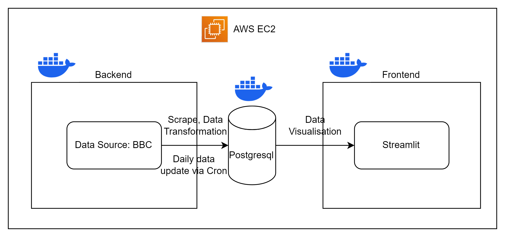
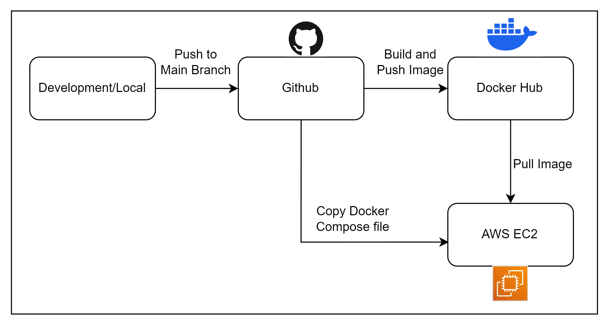

# Batch Processing News Headline Text

The project consists of two components - data pipeline and deployment pipeline.  
The data pipeline involves extracting the dataset from a news website and preparing them for data visualisation using Streamlit. It uses simple cron jobs to schedule daily execution, and is managed through a Docker Compose file.   
The deployment pipeline focuses on pushing the Docker images to Docker hub and running the Docker Compose file on the AWS EC2 platform.  

#### Data Pipeline
1. Data Extraction and Data Cleaning
- Data Scraping of news headline text from BBC website 
- Data Transformation 
- Write to Postgresql
2. Cron jobs to schedule task 1 daily
3. Data visualisation to view the the most common keywords through wordcloud and the corresponding news headline text
- Reference the image of the streamlit app 

#### CI/CD Pipeline

#### Snippet of the streamlit app
